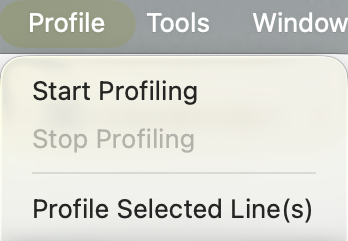

## Parallelisation

You can parallelise by running one job with multi-cores (using `purrr`, `snow`, `foreach`, etc.), parallelise by running multiple jobs, or both!

## Directory setup

Regardless of whether you are conducting a project locally or on Katana, I always like to create two directories:

- `in`: contains any input data. I never write to this directory!
- `out`: contains any output from jobs, such as RDS files, images, etc. 

## Log files

I find it very annoying that all the output and error files clutter up my project directory.

I like to create a folder called log and set the following options at the top of my PBS file:

```
#PBS -o log/
#PBS -e log/
```

This sends the output and error files to the log directory.

## Paths

### here package

It is annoying to re-set paths when you switch back and forth between your local machine and the cloud. Something that helps is using the "here" package. It helps set paths relative to "here".

```{r}
here::here()
```

```{r}
here::here("out", "pval.RDS")
```

### Toggle variable

Alternatively, sometimes I set a clunky option: I have a single variable called `local` which sets a bunch of variable values depending on whether I am on my local machine or in the cloud.

```
local <- TRUE
if(local)
{
  # local
  codedir <- here::here()
  outdirbase <- here::here()
} else
{
  # cloud
  codedir <- Sys.getenv("codedir")
  outdirbase <- Sys.getenv("outdirbase")
}
```


## Resources

- I try to be conservative with my memory usage.
  - You can use Rstudio's built-in profiling tool to estimate memory usage on your local machine.
- I am anti-conservative with walltime.
  - The last thing you want is for a job to time out after a day of running when it was close to finishing!

Profiling tool is in the top menu:

{width=1.5in}
