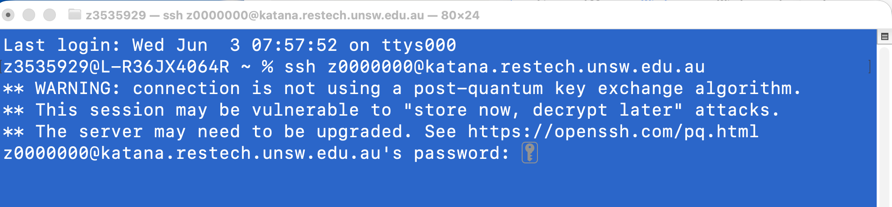
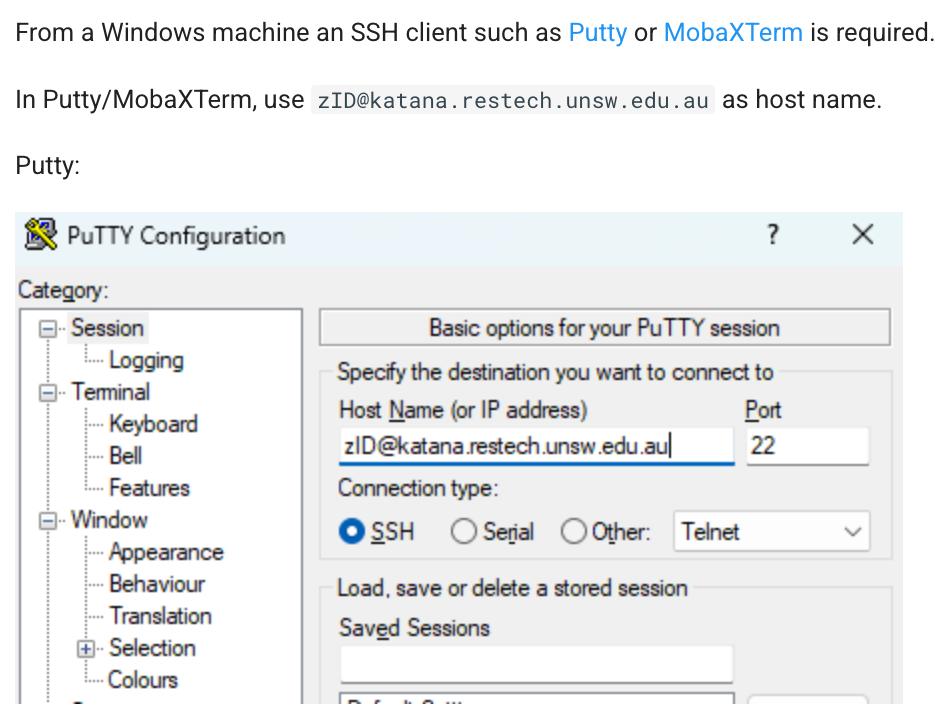
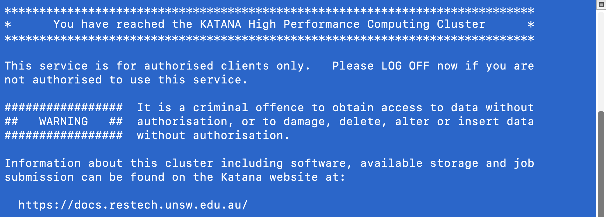

## Accessing katana

- I will only be discussing accessing katana via terminal.
- You can also access through [Katana OnDemand](https://docs.restech.unsw.edu.au/using_katana/accessing_katana/), a graphical session where you can access Rstudio 
- To access Katana via terminal, we will use SSH (Secure SHell) from your local machine.

### Mac

Open up Terminal and SSH into katana:

### Windows

First you will need to download a SSH client such as Putty.

## Welcome message

If you are successful you will see the following

::: {.page-nav}

[Next: Shell commands →](commands.qmd)
:::
