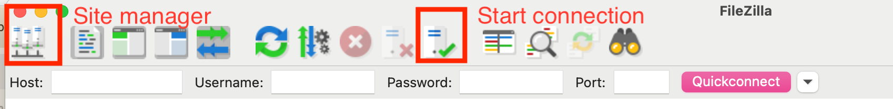
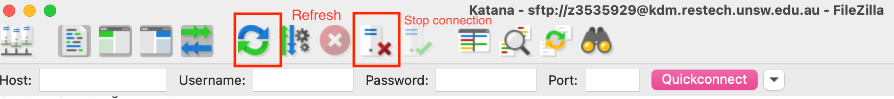
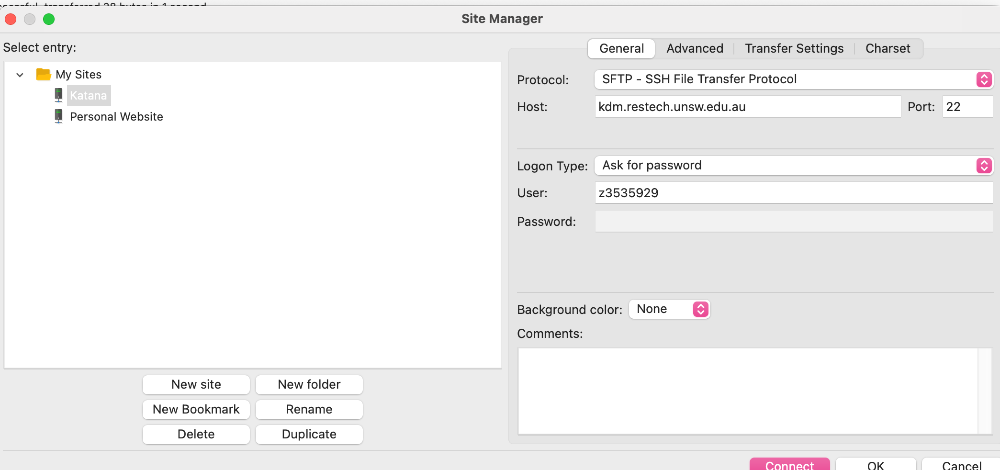
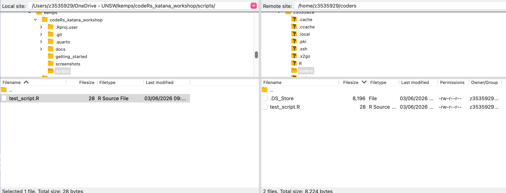

## Options for transferring files

- **Option 1**: Use a file transfer program
  - This option is probably best for most people.
  - Katana recommends FileZilla.
- **Option 2**: Use git
  - Requires command-line knowledge of git.
  - Ensures consistency of file versions across machines.
  - No need to remember if the file on katana is the latest version!
  - I will not cover this option, but feel free to ask me about it.
  
## Let's transfer a file!

### Create a file on your local machine

- Create an R script called test_script.R, or download from the github repo scripts/test_script.R
- Your script should print something out.

### Set up a folder on katana

In your terminal, run:

- `mkdir coders`
- `cd coders`

## Set up FileZilla

### Important menu icons

### Setting up your connection to katana

## Transfer your file

Transfer to your new coders directory.

::: {.page-nav}

[Next: Interactive R session →](../running_r/interactive.qmd)
:::

