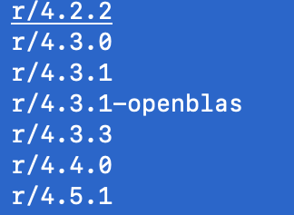

## List available software

Run `module avail` to see the extensive list of software pre-installed on katana.

The following R versions are available

## Run interactive R

Run the following commands:

- `module load r/4.5.1`
- `R`

Now you are running R interactively!

- Run `install.packages("palmerpenguins")`
- Quit by typing `q()`
- Do not save workspace image.

Notes on using interactive R:

- I rarely use this feature!
- Helps me test whether a script will run, mostly to see if files are in the right place and libraries are installed.
- I also use this to install the necessary R libraries before running jobs, so I don't need to re-install every time.
